# Anatomy of a Founding Session

**One working session, start to finish: how a complete framework rewrite went from "let's list goals" to a ratified constitution, an approved design record, a 42-task backlog, and a published repo — collaboratively, with every decision traceable.**

This is a real session (2026-07-28) between Ben and Claude inside an AI development template, redesigning that template's successor ("Keel"). It's shared as a demonstration of a working method, not just its outputs. The companion `session-commentary.csv` holds the full exchange-by-exchange record.

---

## The arc at a glance

```mermaid
flowchart LR
    A[Mine the legacy] --> B[Foundational questions]
    B --> C[Goal gathering]
    C --> D[Concept harvest]
    D --> E[36-item walkthrough]
    E --> F[Remaining decisions]
    F --> G[Two-register documentation]
    G --> H[Backlog + publication]
    H --> I[Verification on demand]
```

Nine phases, but the boundaries were porous by design — Ben added goals mid-walkthrough, opened detours that became standards, and demanded verification at the end. The method absorbed all of it.

---

## Phase 1 — Mine the old thing before designing the new one

Ben's opening framing set the constraint that shaped everything: *"don't take the code, process, etc. as gospel — what we're really looking for are the concepts, abstractions."* A search agent swept the legacy template and returned a 45-concept inventory: every mechanism, its rationale, its realization, plus an unsparing pain-point list (unmergeable binary state, enforcement living in prose, config vocabulary drift).

**Method note:** the session's first hour bought a shared map. Every later decision referenced it — "keep this idea, kill this realization" is only possible when ideas and realizations have been separated first.

## Phase 2 — Foundational questions, strictly one at a time

Three questions, asked singly, each answer reshaping the next: **Who is this for?** (public/open-source — raising the stakes on versioning, CI, docs). **How coupled to one AI harness?** (neutral core + adapters). **Where does state live?** — and here the method showed its value: Claude offered a multiple-choice; Ben declined the menu — *"this deserves more attention."* The resulting discussion produced the session's most load-bearing idea: **state isn't one thing** — six kinds (config, governance, work items, derived indexes, ephemera, history) whose storage rules follow from classification, and whose fusion into one tracked binary file explained most of the legacy system's worst bugs.

**Method note:** the user can always reject the format, not just the options. The menu became a seminar, and the seminar became Article 004.

## Phase 3 — The goal dump, and mid-flight additions

Ben delivered nine goals in one message (ingestion of existing repos with git re-rooting; shipping without git; team-mergeable state; feature toggles; one-script portability; harness-agnosticism; model-aware directives; a hosted update system; credential profiles). Claude played each back with implications and named the tensions between them. More goals arrived *while other work was in flight* — provenance tracking arrived mid-turn alongside a tool result; external-change reconciliation arrived in the middle of walkthrough item 10; pluggable AI providers arrived during item 27. Each was captured, numbered, and folded in without derailing the walkthrough.

**Method note:** goals were checkpointed into the task's notes after every batch — the running list survived any potential context loss, and the final count (18) was auditable against the record.

## Phase 4 — Harvest a sibling project's constitution

Ben pointed at another project built on the same template: *"look at the constitution articles for inspiration."* Six game-specific articles generalized into framework law — and one article's post-mortem context supplied the session's sharpest lesson: rules had been violated for 130 tasks because *"the failure mode was a missing trigger, not missing law."* That became a meta-article: **no rule is ratifiable without naming its enforcement trigger.**

## Phase 5 — The 36-item walkthrough (the session's spine)

Ben asked for every legacy concept stepped through individually: *synopsis, recommendation and why, an example — and I'll interject.* Four items in, he set a protocol that made it fast: **"agree" includes the bundled refinements** — no per-suggestion sign-off, interjection only on disagreement. (Claude saved that to persistent memory.)

The walkthrough produced 16 keeps, 14 changes, 6 kills — but the *deviations* are the demonstration:

- **The numbering saga** (mid-item 20): Ben disliked ambiguous article numbers across scopes. Four proposals volleyed — reserved bands → pure local assignment → "consistency where earned, adaptation everywhere else" → Ben's final banded-blocks design (workspace 1–99, each project a 100-block). The final standard was better than either side's first draft, and the detour was allowed to run to completion before returning to the pending item.
- **A live constitution** (mid-item 18): Ben paused to ask whether the rewrite project itself should have articles *now*. Six were proposed and ratified on the spot — and governed the rest of the session's own decisions.
- **A caught mistake became a design feature**: Ben noticed Claude cite "9 articles" when 11 existed. Cause: category-filtered rule injection had shown a subset, and Claude mistook the filtered view for the whole. The fix became a rule — *injections must self-describe their filtering* — a live demonstration of a failure mode producing law.
- **Organic validation**: the same day, a second template user independently wanted tests-first review ordering — exactly what the just-decided "pipeline as declared data" change enables per-project. Ben also spun off a visual pipeline-editor tool as a tracked task on the spot.
- **User overrides recorded as overrides**: Ben reversed Claude on pruning (silent housekeeping, not propose-first), reclassified a kill into a change (command safety — with push-prevention *as the default*, to guard against the AI itself), and corrected a non-goal's framing (the framework *is* architecturally opinionated — "code isn't a blocker anymore," so abstraction is encouraged, not rationed).

## Phase 6 — The remaining decisions

Engine language (TypeScript/Node — the harnesses already guarantee the runtime); team workflow (chosen from **four worked scenarios** — solo two-machine, PR team, shared main, and a mixed team with a non-AI developer whose pushes the system metabolizes automatically); ten non-goals (each a declined support burden, written down); the deferred multi-repo future (Ben sketched a coordinator-repo model; three cheap forward-compatibility seams were written into current tasks so v1 never forecloses it); and the name — **Keel** — chosen from two shortlist rounds with collision checks.

## Phase 7 — Documentation in two registers

Only after everything was agreed did writing begin (the design gate forbids writing the plan before the conversation concludes). Two registers, deliberately: a **condensed founding doc** (identity, principles, goals, non-goals, architecture sketch) and a **seven-document technical decision record** — every verdict with its rationale, rejected alternatives, and worked examples, so no future session can re-litigate settled ground. A reviewer agent then audited the set and found a real contradiction (prose said sixteen goals; the table listed eighteen) — fixed before approval. The project's own review pipeline ran end-to-end, including an unplanned demonstration: the commit gate blocked the first commit because the staged files spanned *two* project scopes, each requiring its own review acknowledgment. The enforcement being designed was enforcing the design.

## Phase 8 — Backlog and publication

Ben: *"wouldn't it be good to generate all of the tasks needed?"* — 29 milestone-grade tasks across 8 arcs, every implementation task gated behind a design task (detail arrives just-in-time from the gates, not faked upfront). Then a commit deliberately scoped to session artifacts only (pre-existing unrelated changes were named and excluded, not silently swept), a new public GitHub repo, and a push through the sanctioned confirmation flow.

## Phase 9 — Verification on demand (the user's move)

Ben didn't accept the backlog on faith. Three escalating demands:

1. *"Show me task detail examples"* — verbatim records with their anatomy.
2. *"Validate the chain — is everything captured, detailed enough for the full SDLC?"* — an audit agent swept goals × decisions × tasks bidirectionally and found **nine genuine gaps** (including an entire health engine with a tool surface but no implementation owner, and end-user docs declared "core" but owned by nobody). Seven new tasks and a batch of fixes closed them, raising the backlog to 42.
3. *"Walk one task end-to-end using only its own path"* — a live walk of T-007: task record → routed docs (ranked, with 14 constitution articles injected automatically) → the spec with worked examples → the parent-hub chain to full session context. Including an honest statement of what the path *doesn't* carry (conversational texture — by design).

**Method note:** the audit only happened because the user pushed. The assistant's confidence was then given *calibrated* — high where audited, structural where design gates will fill detail, honest about residual risks (gates need the human; implementation will surface unknowns; the docs are single-authored until the first gate stress-tests them).

---

## The method, distilled

1. **Separate concepts from realizations before deciding anything.** Mine what exists; keep ideas, not code.
2. **One question at a time — and let answers change the next question.** Batching is structurally incapable of this.
3. **The user steers the format, not just the content.** Menus can be refused; walkthroughs can be requested; detours are allowed to finish.
4. **Establish interaction protocols early** ("agree includes refinements") and persist them.
5. **Capture goals the moment they appear** — including mid-turn — and checkpoint the running state where it survives context loss.
6. **Let caught mistakes become design features.** The 9-vs-11 miscount produced a self-describing-output rule.
7. **Govern the work with the system being built.** Ratify the rules early; let them bind the rest of the session.
8. **Write documentation only after agreement, in two registers** — orientation and full fidelity — then review it like code.
9. **Backlog = design gates before implementations.** Don't fake detail the gates will produce.
10. **Verify on demand, with agents, and fix what the audit finds.** Confidence is something you earn with a traceability matrix, not something you assert.
11. **Scope commits honestly; publish deliberately; never push without a human.**

**Session outputs:** 18 goals · 36 dispositioned concepts · 6 ratified articles · 8 approved docs · 42 tracked tasks · 1 public repo · 2 reference artifacts (this file and the CSV).
