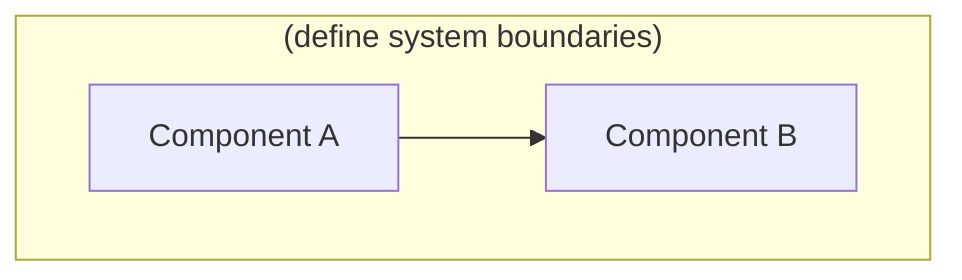
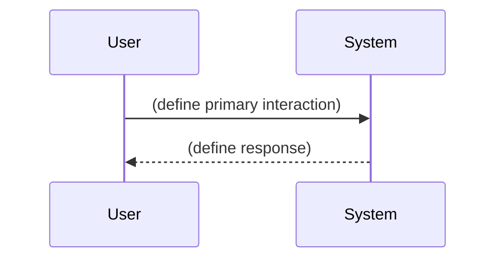

> **Version:** 0.2.0
> **Last Updated:** 2026-07-29
> **Status:** Draft

# Architecture

## Overview

(Fill in during onboarding: what this system does and why it exists.)

## System Diagram

(Replace with actual system architecture after onboarding.)

## Components

| Component | Purpose | Location |
|-----------|---------|----------|
| Keel engine (`keel-engine`) | TypeScript/Node engine for the Keel rewrite — state, routing, board, and git layers land here (T-009+) | `ai-development-template/` |
| CI pipeline | `npm run ci` gate on PRs and pushes to main; ubuntu/macos × Node 20/22 required, windows advisory | `.github/workflows/ci.yml` |
| Legacy template engine | Python MCP servers, hooks, and enforcement scripts (being rewritten as Keel) | `.claude/scripts/` |

## State Model

The template is **projects-first**. There is always a `projects` collection in `claude.db`.
Row `id=1` is the always-present `workspace` pseudo-project — the **umbrella only**: it holds
cross-cutting tasks, the workspace tier of constitution articles, and serves as the resolution
fallback. **You never work directly on the workspace row.** Every actual project — regardless of
workspace shape — is a real `projects[]` entry (`slug`, `name`, `path`, `source_roots`,
`source_extensions`, `test_command`) living in its own `./<slug>/` subfolder, created via the
shared `new_project.py` helper. Nothing a user works on ever lives at the repo root; the root
holds only the engine (`.claude/`), workspace-tier docs, and each project's subfolder.

| Shape | `projects[]` | Enforcement | Layout |
|-------|--------------|-------------|--------|
| single | 1 entry | `full` | `./<slug>/` |
| scratch | 1 entry | `minimal` | `./<slug>/` |
| multi | N entries | `full` | `./<slug-1>/`, `./<slug-2>/`, … |

"Single → multi" is simply adding more entries via `/add-project`; there is no migration and no
structural difference — single is just "one project."

**Per-project scoping.** Boards, status (phase/blockers), reviews, health, routing, and the
constitution are all scoped per project (the old singleton `project_status` table is gone —
phase/blockers live on each `projects` row). Tasks, routing, the activity log, and constitution
articles all carry a `project_id`; `review_order` and `health_metadata` are keyed per project.
Task IDs are globally unique across the workspace.

**Active project.** A workspace-global, durable pointer marks the active project (it is **not**
session-scoped — MCP servers cannot read session state). Resolution order for any project-scoped
operation: explicit `project=<slug>` argument > active pointer > inference from edited files >
`workspace` fallback. The pointer follows edited files, and every project-scoped response echoes
`[project: <slug>]`. The SessionStart hook emits `ENFORCEMENT:`, `ACTIVE_PROJECT:`, and
`PROJECTS:` lines.

**Two-tier constitution.** Workspace-tier articles apply to every project; each project may add
its own. The effective set for a project is the union (workspace ∪ project), numbered per tier.
Workspace-tier markdown lives in `docs/constitution/`; a project's own articles live in
`<project.path>/docs/constitution/`.

**Enforcement** is a workspace-level setting (`full` | `minimal`). `minimal` is the lightweight
mode (no review pipeline, minimal onboarding); `full` activates reviews, doc enforcement,
constitution, and task gates.

## Tech Stack

| Layer | Technology | Notes |
|-------|-----------|-------|
| Keel engine | TypeScript (strict, ESM, NodeNext) on Node >= 20 | Vitest + v8 coverage, ESLint (type-checked) + Prettier; npm with committed lockfile |
| Legacy engine | Python 3.x | MCP servers, hooks, pytest regression tests |

## Data Flow

(Replace with actual data flow after first feature is designed.)

## Sub-Documents

| Document | Description |
|----------|-------------|
| [keel-rewrite-goals.md](../features/keel-rewrite-goals.md) | Keel founding document — goals, concept inventory, keep/change/kill verdicts |
| [keel-decisions/index.md](../features/keel-decisions/index.md) | Technical decision records (platform, state model, workflow, distribution, governance, collaboration) |
| [state-layer.md](../features/state-layer.md) | Keel state layer design (T-007) |
| [engine-scaffold.md](../features/engine-scaffold.md) | Keel engine scaffold & CI — source tree, toolchain, test strategy (T-008) |

Feature docs live in `docs/features/`. Each new system or feature gets its own doc following the standard structure defined in [conventions.md](../guides/conventions.md).

## Related

- [Constitution](../constitution/index.md) — project rules
- [Conventions](../guides/conventions.md) — coding and documentation standards
