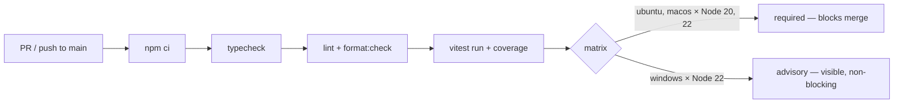

# Keel Engine Scaffold & CI — Design

**Version:** 1.0.1 | **Last Updated:** 2026-07-29 | **Status:** Approved
**Task:** T-008 | **Decision record:** [keel-decisions/platform.md](keel-decisions/platform.md) | **Parent design:** [state-layer.md](state-layer.md)

## Overview

Stands up the Keel engine source tree: a TypeScript/Node project with build, lint, and test tooling, plus GitHub Actions CI running on every PR. This is the foundation T-009 (state layer), T-010 (routing index), and T-011 (board renderer) implement into. It also states the engine's own test strategy — unit/integration split, fixture conventions, coverage expectations — as required by audit fix SDLC-D.

Fixed upstream, not re-decided here: TypeScript/Node engine (platform decision record), no per-platform binaries, WSL/Linux/macOS required with native Windows nice-to-have, one language for servers/hooks/tooling.

Decisions from this design's interview (2026-07-29):

| Decision | Choice | Rationale |
|----------|--------|-----------|
| Package shape | Single npm package, clean internal module boundaries | Simplest artifact + lockfile story for the update channel; split later only if a real seam demands it |
| Test runner | Vitest (dev-dependency only) | Best DX for fixture-heavy suites: watch mode, snapshots, built-in v8 coverage; contributor familiarity |
| Lint/format | ESLint (typescript-eslint, type-checked rules) + Prettier | Type-aware lint catches the strongest defect class in async fs/git code; conventional public-project setup |
| CI matrix | Ubuntu + macOS required, Windows advisory; Node 20 + 22 | Matches declared platform tiers; Windows visible but non-blocking |

## Source Tree

Engine code is the product code of the `ai-development-template` project and lives in its project folder. CI workflows live at the repo root (GitHub Actions only reads `.github/` there).

```
<workspace root>
  .github/workflows/ci.yml      CI pipeline (PRs + pushes to main)
  ai-development-template/
    package.json                name: keel-engine; type: module; engines >= 20
    package-lock.json           committed — lockfile is part of the artifact story
    tsconfig.json               strict, ESM, NodeNext resolution (compiles src/ only)
    tsconfig.test.json          extends base; adds tests/ + vitest.config.ts for typecheck & type-aware lint
    eslint.config.js            flat config, typescript-eslint type-checked preset
    .prettierrc.json            defaults; no debate surface
    vitest.config.ts            coverage config, test globs
    src/
      index.ts                  public API barrel
      git/                      thin repo-parameterized git layer (G18 seam 3)
    tests/
      unit/                     mirrors src/ one-to-one (src/<module>/<file>.ts ↔ tests/unit/<module>/<file>.test.ts)
      integration/              cross-module flows on real temp git repos
      fixtures/                 shared fixture corpus (conventions below, restated in its README)
    dist/                       gitignored build output (tsc)
```

Module folders beyond `git/` are added by the arcs that own them — `state/` (T-009), `routing/` (T-010), `board/` (T-011), and later seams (`mcp/`, `adapters/`). The scaffold does not pre-create empty directories for future work.

## Toolchain

| Option | Type | Default | Description |
|--------|------|---------|-------------|
| Module system | — | ESM (`"type": "module"`) | NodeNext resolution; no CJS interop debt in a greenfield engine |
| TypeScript | dev | strict + `noUncheckedIndexedAccess` | Compile with `tsc` to `dist/`; `tsc --noEmit -p tsconfig.test.json` is the typecheck gate (covers `src/`, `tests/`, `vitest.config.ts`) |
| Node range | — | `engines: >=20` | Harness-guaranteed runtime; CI tests 20 and 22 |
| Package manager | — | npm | Guaranteed alongside Node; lockfile committed |
| Dev execution | dev | `tsx` | Run TS directly during development; never a runtime dependency |

Runtime dependencies start at zero and are added deliberately by feature tasks (e.g. the comment-preserving YAML parser belongs to T-009). Dev dependencies never ship in the artifact (Engine/Data Separation is about logic; this is the footprint corollary).

npm scripts (the interface other tasks and CI consume):

| Script | Purpose |
|--------|---------|
| `build` | `tsc` → `dist/` |
| `typecheck` | `tsc --noEmit` |
| `test` | `vitest run` with coverage |
| `test:watch` | `vitest` watch mode |
| `lint` | ESLint over `src/`, `tests/`, and `vitest.config.ts` |
| `format` / `format:check` | Prettier write / verify |
| `ci` | `typecheck && lint && format:check && test` — the exact gate CI runs, reproducible locally |

## CI Pipeline



Every PR and push to main installs from the lockfile (`npm ci`), then runs the same `ci` script developers run locally. The four required matrix legs (ubuntu/macos × Node 20/22) block merge; the single Windows leg reports status without blocking (`continue-on-error`), keeping the nice-to-have tier visible rather than silent.

## Test Strategy (SDLC-D)

- **Unit tests** (`tests/unit/`) mirror `src/` one-to-one and test pure logic in isolation: parsing, canonical serialization, schema validation, ID minting, scoring. No real git, no network; filesystem only via per-test temp directories.
- **Integration tests** (`tests/integration/`) exercise cross-module flows against real temporary git repositories: write→index→render side-effect chains, post-merge validator repairs, freshness-guard rebuilds. Slower and fewer; still hermetic (temp dirs, no network).
- **Fixture conventions:** `tests/fixtures/<area>/<case>/` holds an `input/` state tree and expected outputs (`findings.json`, `repaired/`, or rendered artifacts). Validator fixtures are named by V-rule (`fixtures/validator/v06-category-prefix-mismatch/`). Every repair fixture gets an automatic idempotence assertion — a second pass over repaired output must find nothing (Article 002).
- **Determinism harness:** randomness (ID minting), dates, and process execution are injected as seams so unit tests are hermetic and expected outputs byte-exact; the git layer's injectable `ExecFileFn` (in `src/git/index.ts`) is the first such seam. Byte-equivalence tests rebuild derived artifacts twice and compare buffers.
- **Coverage expectations:** v8 coverage via Vitest; global thresholds 80% lines / 75% branches enforced in CI from the first real module. The state layer's validator table is expected to sit well above the floor — every V-rule ships fixtures. Thresholds are declared in `vitest.config.ts`, not scattered in CI.

## Dependencies

- **Consumed by:** every subsequent Foundation/Workflow/Platform implementation task.
- **Consumes:** Node ≥ 20 and npm (harness-guaranteed); GitHub Actions (repo already lives on GitHub). No runtime dependencies at scaffold time.

## Error Handling

- CI failure semantics: required legs fail → merge blocked; Windows leg fails → PR shows an advisory ✗ with logs, merge unaffected.
- `npm ci` (never `npm install`) in CI: a drifted lockfile is a hard failure, not a silent resolution.
- Coverage below threshold fails `test` locally and in CI identically — one gate, two invocation sites.

## Security Considerations

- CI workflow gets `permissions: contents: read` only; no secrets are used or needed at this stage.
- Third-party actions pinned to commit SHAs, not floating tags.
- Lockfile-only installs prevent dependency drift between review and merge (supply-chain hygiene for a public repo).

## Testing Notes

The scaffold verifies itself by execution (setup principle: verify the capability, not its indicator): it lands with one real unit test and one real integration test exercising the temp-dir harness, so the first CI run proves the toolchain end-to-end rather than passing vacuously on zero tests. Coverage thresholds activate with the first real module (T-009) to avoid gating on placeholder code.
