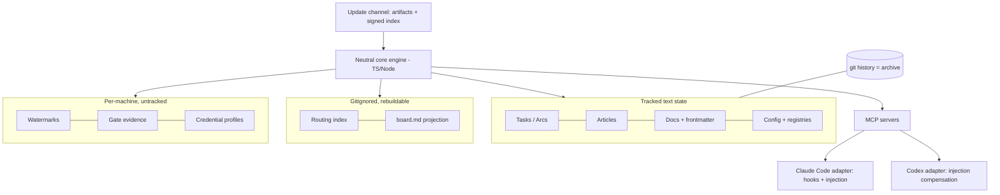

# Keel — Rewrite Goals & Concept Inventory

**Version:** 1.0.0 | **Last Updated:** 2026-07-28 | **Status:** Approved

The founding document for **Keel**, the ground-up rewrite of the AI development template. Produced from the T-001 goal-setting interview (2026-07-28): a full concept extraction of the legacy PROJECT-TEMPLATE (v2.5.0), eighteen goals (sixteen gathered from Ben upfront; G17 arcs and G18 multi-repo emerged during the non-goals discussion), a 36-item keep/change/kill walkthrough with per-item verdicts, and a base-article harvest from the_oval_game's constitution. This doc records **what Keel is and why**; the full technical decision record with rationale and worked examples lives in [keel-decisions/](keel-decisions/index.md), and per-feature design docs will follow.

## What Keel Is

Keel is a public, open-source framework that turns AI coding harnesses (Claude Code, Codex, and future peers) into disciplined, spec-driven development partners. Its identity: a **constitution-centered, state-carrying governance layer** whose durable state travels with the repo as mergeable text, works identically across harnesses and models, supports teams, and can be extended without forking. The name is the thesis: state and governance are the keel — laid down first, everything built on them, last thing to fail.

## Design Philosophy

1. **Text is truth; everything else is derived.** Durable state is per-entity, human-readable, git-mergeable text. Indexes, projections, and caches are rebuildable artifacts, never tracked.
2. **Intelligence at write time, mechanics at read time.** LLM judgment gets frozen into data (frontmatter, curated keywords, categories) when content is authored; every later operation on it is deterministic, free, and offline.
3. **Declare what must hold; enforce what each harness can.** The neutral core states rules as data; adapters enforce by blocking (hooks) where possible and by in-band assertion (injection) everywhere else. Degradation is explicit, never silent.
4. **Adapt to actions rather than enforce against them.** Collisions get repaired, preferences get honored when free, external changes get reconciled — the system bends around what it finds.
5. **One is a count, not a shape.** Anything that might be plural is always plural: projects, credential profiles, model overlays, repos (deferred), watermarks.
6. **Abstraction is cheap now — bias toward structure.** Code volume stopped being the scarce resource, so Keel deliberately encourages modular, extensible, generously-abstracted systems over minimal ones. Human readability is maintained as a courtesy in the code itself; abstraction depth is no longer rationed to protect human authors.
7. **Context is the scarcest resource.** Sessions are short and cleared freely; state makes that free. Routing loads only what's needed; size limits and startup budgets are governed numbers.

## Foundational Decisions

| Decision | Choice |
|----------|--------|
| Audience | Public / open-source — versioning discipline, migrations, CI, stranger-docs are core |
| Architecture | Neutral core + harness adapters; capability matrix per adapter; injection compensates for missing hooks |
| State model | Per-entity text as truth; state-kind taxonomy (truth / derived / ephemera / history); git is the archive |
| Engine | TypeScript/Node — runtime guaranteed by the harnesses; one language for servers, hooks, scripts, extensions |
| Platforms | WSL, Linux, macOS required; native Windows nice-to-have; one setup script, ever |
| Team shape | PR-first recommended and optimized; shared-main, solo multi-machine, and mixed AI/non-AI teams fully supported |
| Name | **Keel** — template skills prefixed `/keel-*`; user skills get a distinct prefix (final word [Pending: choose user-skill prefix]) |

## Goals

| # | Goal |
|---|------|
| G1 | Existing-repo ingestion with git re-rooting — offer keep-history (recommended) or fresh-start |
| G2 | Keel ships as a built artifact, not a git clone; git belongs to the user's workspace |
| G3 | Team-ready mergeable state — docs, routing, constitution merge like code; post-merge validate/repair |
| G4 | Per-feature toggles via a feature registry + `/keel-features` skill; presets (scratch/standard/team, extensible) |
| G5 | Machine portability — clone, run one idempotent setup script, work immediately |
| G6 | Harness-agnostic core; CLAUDE.md/AGENTS.md are thin generated shims over shared neutral instruction docs |
| G7 | Default directive set + sparse per-model overlays, shipped as data through the update channel |
| G8 | Hosted update system — static versioned artifacts + signed index; detect, prompt, backup, dry-run, three-way merge |
| G9 | Credential/provider profiles chosen at onboarding (e.g. personal Claude vs Bedrock); per-machine, never tracked |
| G10 | Provenance for everything — pristine-baseline three-way merges; namespaced extension points; user additions survive updates structurally |
| G11 | Tutorial always available + offered in onboarding + post-onboarding nudges; one curated content corpus, two delivery modes |
| G12 | Onboarding dissolves itself — setup-only assets are manifest-marked and cleaned up at completion |
| G13 | Tasks as the context on-ramp — start work without re-giving context; documentation accumulates gradually in tasks |
| G14 | Three-namespace commands (harness / `/keel-*` / user-prefixed) + a skill-builder skill for approved user skills |
| G15 | External-change reconciliation — per-machine commit watermark; automatic discovery with pre-proposed resolutions; onboards non-AI teammates' work |
| G16 | Pluggable AI providers — provider registry; review stages may execute on a different model/vendor (cross-model adversarial review); degrades gracefully without credentials |
| G17 | Arcs — first-class task grouping (name, intent, ordered members, notes) as mid-altitude context; narrative structure, never sprints |
| G18 | *(Deferred)* Multi-repo coordination via a coordinator workspace; v1 holds the seams open (external-capable project paths, per-repo watermarks, repo-parameterized git layer) |

## Non-Goals

1. **Not an editor manager** — no IDE downloads; editor-friendly artifacts and extension suggestions only.
2. **Not CI/CD** — Keel ships a CI template that validates state; the user's build/deploy pipelines are their forge's business.
3. **Not a PM suite** — no sprints, points, burndowns, dashboards, or time tracking. Arcs (G17) are core because they serve AI context. Bridges to external PM systems (e.g. Azure DevOps) are a supported extension class, off by default.
4. **Not a distributed-consistency system** — state is eventually consistent at git speed; races are made visible fast, not arbitrated.
5. **Not a scaffolder or stack-chooser** — Keel never picks languages or generates product code, and learns project conventions as data. It **is** unapologetically opinionated about architectural values (philosophy #6).
6. **Not a harness replacement or agent runtime** — Keel orchestrates within harnesses; G16 provider calls are optional, delegated work only.
7. **Not a secrets manager** — profiles reference credentials; secrets live in the platform's own stores.
8. **No resident processes** — every operation is a one-shot, idempotent invocation; nothing to daemonize or restart.
9. **Not semantic search** — routing is deterministic scoring by design; the scorer is a swappable registry entry for those who want more.
10. **One workspace = one repo in v1** — monorepo (N projects, one repo) is the core shape; multi-repo federation is deferred (G18), not refused.

## Architecture Sketch

The engine reads and writes tracked truth, rebuilds derived artifacts idempotently, and keeps machine-local ephemera out of the repo. Harnesses reach everything through MCP; the Claude Code adapter enforces with hooks where Codex's compensates with stronger in-band injection. Updates arrive as artifacts three-way-merged against a pristine baseline. Git history serves as the permanent archive for pruned state.

## Concept Dispositions (36-item walkthrough summary)

**Kept (16, all with adopted refinements):** constitution system; category-filtered in-band rule injection (now self-describing, with capability compensation); anti-rubber-stamp design gate; task boards with freezer/trash; orchestrator/implementer separation (delegation threshold as data); three-signal routing (declared weights, swappable scorer); `load_at_start` (frontmatter + startup token budget); two-speed health checks (health-kind registry); resumable one-question-at-a-time onboarding (declarative question graph); projects-first; active-scope echo (`[project: slug]`); curated tutorial (modular per-feature topics); `[Pending]` markers auto-creating tasks; findings→tasks (generalized to all finding sources); context doctrine; verification-by-execution (smoke-test registry + `doctor`).

**Changed (14):** SQLite → text-as-truth (markdown+frontmatter entities; body-only size limits); enforcement binary → feature registry with presets; update script → baseline three-way merge over a dumb static channel; generated CLAUDE.md → thin shims over 3-layer instruction assembly (core/harness/model); review pipeline → per-project declared stage graph (stages are registry entries; executor may be a G16 provider); reviewer rubrics → assembled from core method + project conventions + trigger-matched articles; sequential IDs → typed short random slugs; commit gate → shell-parsed per-segment verdicts, fixture-tested; destructive GC → git-as-archive with silent retention pruning + archive-lookup tool; session-end snapshot → render-on-mutation live `board.md` (no LLM, no tokens); static directives → model overlays; config → one versioned, validated, migrated schema; git deny-list → tiered command-safety module, secure default (push prevention + data-driven deny-list via update channel); workspace pseudo-project → workspace as a first-class scope.

**Killed (6):** tracked binary DB; legacy config vocabulary; Python-literal release manifest; `template_dev` flag (artifact builds + pristine-boot smoke test replace it); portable VSCode / `start-workspace.bat` (a Mermaid-focused tooling nudge remains); bug-detection regexes (explicit category field; agent/pipeline auto-classification; validator-enforced coverage).

## Constitution

**Governing the rewrite now (ratified 2026-07-28):** ai-development-template/001 Engine/Data Separation · 002 Idempotent, Reproducible Operations · 003 Registries Over Bespoke Code Paths · 004 State Declares Its Kind · 005 Every State Kind Is Inspectable · 006 Articles Must Name Their Trigger. These six are also the prototype for Keel's shipped base set, alongside candidates inherited from the legacy workspace tier and a philosophy-#6 article. Optional **article packs** (e.g. AI-boundaries from oval-game Art. 012) are versioned, offered at onboarding, and toggleable.

**Numbering standard:** banded blocks per scope — workspace 1–99 (framework-preferred numbers honored when free, adapted when not), each project allocated a 100-block recorded in its config, overflow allocates the next free block. Slugs are identity; numbers are local display aliases; shipped content self-references by slug with render-time resolution; post-merge repair renumbers collisions.

## Open Items

- [Pending: choose the user-skill prefix word (G14) — decided during the naming/branding design pass]
- [Pending: final governance vocabulary pass — article vs amendment terminology; amendments modeled as events]
- [Pending: prebuilt-index download for very large monorepos — scaling note only, not v1]
- [Pending: article-pack number promotion into a reserved band if community vocabulary demand emerges]

## Related

- Task T-001 (this interview), T-002 (visual pipeline editor, P2)
- Legacy concept extraction report (session artifact, 2026-07-28)
- the_oval_game constitution articles 012, 014, 015, 018, 022, 030 (base-article inspiration)
- [keel-decisions/index.md](keel-decisions/index.md) — the full technical decision record
