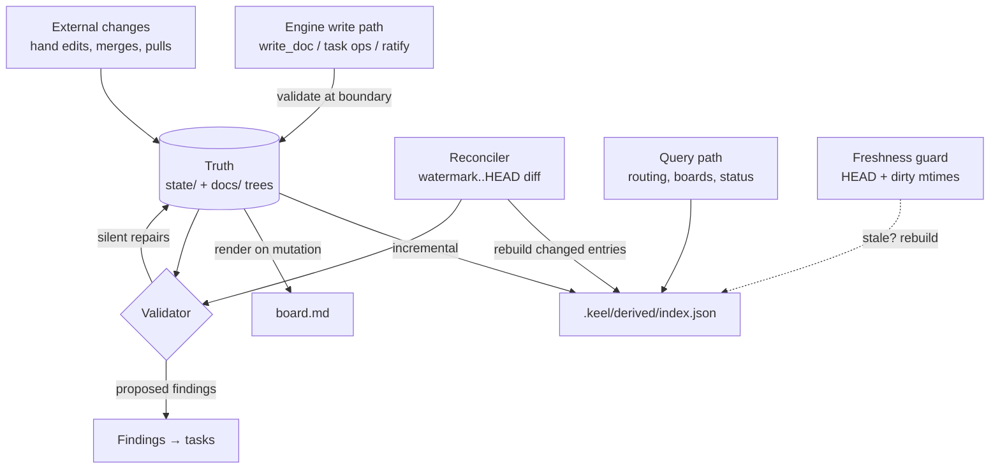

# Keel State Layer — Design

**Version:** 1.0.0 | **Last Updated:** 2026-07-29 | **Status:** Approved
**Task:** T-007 | **Decision record:** [keel-decisions/state-model.md](keel-decisions/state-model.md)

## Overview

The state layer is Keel's foundation: every entity the framework persists (tasks, arcs, articles, docs, config), where each lives, how IDs are minted, how files are validated and repaired, and how curated routing signals are stored. It implements the ratified state-kind taxonomy (Article 004): **truth** is per-entity mergeable text tracked in git; **derived** is gitignored and rebuildable; **ephemera** is per-machine and never tracked; **history** is git itself.

Decisions fixed upstream and not re-litigated here: text-as-truth architecture, markdown+frontmatter formats, random-slug IDs, banded article numbers, git-as-archive, the board.md projection (see the decision record). Decisions made in this design's interview (2026-07-28): **per-project state layout**, **created-only timestamps**, **strict core schemas with an `ext:` extension namespace**.

## Directory Layout

Each project folder is self-contained: its state travels with its code. Workspace-scope state lives at the repo root. Derived artifacts and ephemera live under `.keel/`, excluded by a shipped `.gitignore`.

```
<workspace root>
  state/                      TRUTH, workspace scope
    tasks/                      T-*.md, B-*.md, S-*.md
    arcs/                       A-*.md
    articles/                   <slug>.md
    config/
      workspace.yaml            workspace config + projects registry
    routing/
      curation.yaml             workspace-scope curated code hints (sparse)
  docs/                       TRUTH, workspace-scope docs (frontmatter carries routing truth)
  board.md                    DERIVED, gitignored — rendered projection
  .keel/                      gitignored entirely
    derived/
      index.json                routing index (rebuildable, delete anytime)
      head.json                 index freshness stamp (git HEAD + dirty mtimes)
    local/                    EPHEMERA, per working copy
      scope.yaml                active-scope pointer
      watermarks.yaml           reconciliation watermarks, keyed by repo-root
      evidence/                 review-gate evidence, per task
  <project>/                  one folder per registered project
    state/
      tasks/  arcs/  articles/
      config.yaml               project config (article block, retention, …)
      routing/curation.yaml     curated code hints for this project (sparse)
    docs/                     project docs
    src/ …                    product code (never touched by the state layer)
```

| Path | Kind | Rule |
|------|------|------|
| `state/`, `<project>/state/` | Truth | Tracked; text only; one entity per file |
| `docs/`, `<project>/docs/` | Truth | Tracked; frontmatter is routing truth |
| `board.md`, `.keel/derived/` | Derived | Gitignored; rebuildable byte-equivalently (Article 002) |
| `.keel/local/` | Ephemera | Gitignored; loss is safe (re-run reviews, re-reconcile) |
| Git history | History | Never destructively garbage-collected |

Notes:

- Ephemera lives **inside the working copy** (`.keel/local/`), so "per machine" is implicitly "per working copy" — two clones on one machine keep separate gate evidence, which is more correct, not less (evidence attests to a working copy's file state). Watermarks are still keyed by repo-root **inside** the file (G18 seam 2: one is a count, not a shape).
- Credential profiles (G9) are also ephemera but are shared across workspaces on a machine; they live under the user home directory, not `.keel/`. Their format is owned by the onboarding design. [Pending: credential profile file format — owned by T-023]
- The validator hard-fails if any `.keel/` path or `board.md` is ever tracked (V-13 below) — the shipped `.gitignore` is the fence, the validator is the alarm.

## File Formats

- Human-facing entities (tasks, arcs, articles, docs): **markdown + YAML frontmatter**. Frontmatter is machine surface; the body is prose and a first-class diff/merge surface.
- Structural records (config, curation, manifests): **YAML**.
- Size limits count the **prose body only**, excluding frontmatter. Health checks report both numbers.
- Frontmatter is written back in a **canonical serialization** (fixed key order per schema, 2-space indent, no flow maps): idempotent rewrites produce byte-identical files (Article 002) and diffs stay minimal.

### Schema strictness (interview decision)

Core fields are validated strictly: an unknown bare key in frontmatter is a validator finding (catches `statuss:`). All extension data lives under a single `ext:` map keyed by extension name — provenance built in (G10). The validator always preserves `ext:` content untouched; if a feature-registry entry declares a schema for its named `ext:` block, that block is validated too (Article 003). Example:

```yaml
ext:
  azure-devops:
    work_item: 4412
```

## Entity Schemas

All entities share three invariants: `id` (immutable identity), `created` (stamped once at mint, `YYYY-MM-DD`, never updated — modification history is git's job), and optional `ext:`. There is no `updated` field: it duplicates git and is a guaranteed same-line merge conflict.

### Task

File: `…/state/tasks/<id>-<kebab-title>.md`. The filename's kebab-title is a human courtesy; **id is the identity** — renaming the file on retitle is legal and `git log --follow` tracks it.

| Name | Type | Required | Default | Description |
|------|------|----------|---------|-------------|
| `id` | string | yes | — | `T-`/`B-`/`S-` + 5-char slug (see ID Minting) |
| `title` | string | yes | — | Short imperative summary |
| `status` | enum | yes | `todo` | `todo` \| `working` \| `awaiting-validation` \| `done` \| `frozen` \| `trashed` |
| `category` | enum | yes | — | `task` \| `bug` \| `security` — explicit, never regex-guessed; prefix must agree (V-6) |
| `priority` | enum | yes | — | `P0`–`P3` |
| `arc` | string | no | — | Arc id this task belongs to |
| `assignee` | string | no | — | Visibility, not locking (claims are eventually consistent) |
| `depends_on` | string[] | no | `[]` | Task ids this task waits on |
| `provenance` | object | no | `{source: user}` | `source` (`user` \| `agent` \| finding type) plus structured origin for findings: review stage, commit, file/line |
| `created` | date | yes | — | Mint date |
| `ext` | map | no | — | Extension namespace |

Body contract: opening prose (the context on-ramp, G13), then optional `## Acceptance` and `## Notes` sections. Acceptance is required by pipeline config at the design gate, not by the schema — the schema stays preset-neutral (Article 001).

`frozen` and `trashed` are statuses, not separate directories: boards are projections over status, and moving between boards must be a one-line frontmatter diff, not a `git mv` (smaller conflicts, stable paths for `--follow`). Trash is soft deletion — recoverable until retention pruning `git rm`s it into the archive; the **freezer never auto-prunes**.

### Arc

File: `…/state/arcs/<id>-<kebab-name>.md`. Narrative structure, never sprints — no dates, velocity, or estimates by design.

| Name | Type | Required | Default | Description |
|------|------|----------|---------|-------------|
| `id` | string | yes | — | `A-` + 5-char slug |
| `title` | string | yes | — | Arc name |
| `status` | enum | yes | `open` | `open` \| `done` — health checks propose closing when all members complete |
| `members` | string[] | yes | `[]` | **Ordered** task ids — order is the arc's rough sequence |
| `created` | date | yes | — | Mint date |
| `ext` | map | no | — | Extension namespace |

Body contract: the **intent statement** as opening prose (why these tasks form one story, which design doc they serve), then optional `## Notes`. Membership is stored on the arc (ordered, one place to read the story); the task's `arc` field is the back-reference, and V-5 repairs disagreements.

### Article

File: `…/state/articles/<slug>.md`. **Slug is identity; number is a local display alias** (banded numbering standard — see [keel-decisions/governance.md](keel-decisions/governance.md)). Shipped content references articles by slug only.

| Name | Type | Required | Default | Description |
|------|------|----------|---------|-------------|
| `slug` | string | yes | — | Provenance-bearing identity, e.g. `keel/engine-data-separation` or `<project>/no-inline-sql` |
| `number` | int | yes | — | Local alias within the scope's band (workspace 1–99; project blocks of 100) |
| `title` | string | yes | — | Article title |
| `status` | enum | yes | `proposed` | `proposed` \| `ratified` \| `revoked` |
| `category` | enum | yes | — | Injection filter category (`design`, `documentation`, `collaboration`, …, from declared config) |
| `triggers` | string[] | yes | — | Concrete enforcement triggers (Article 006: no ratification without one), e.g. `code-review`, `commit`, `doc-write` |
| `preferred_number` | int | no | — | Framework-shipped articles only: honored if free, adapted if not |
| `provenance` | object | yes | — | `source`: `framework` \| `pack:<name>` \| `local`; pack version if applicable |
| `created` | date | yes | — | Proposal date |
| `amendments` | object[] | no | `[]` | Amendment **events**: `{date, summary}`; full text history is git's job |
| `ext` | map | no | — | Extension namespace |

Body contract: `## Context`, `## Rule`, `## Consequences`, `## Enforcement` — all four required at ratification (V-8). Ratification and revocation are status transitions plus an `amendments` event; the render layer resolves slug references to local numbers at display time. [Pending: final article/amendment vocabulary — owned by T-004; the `amendments`-as-events field is forward-compatible with both outcomes]

### Doc frontmatter

Docs live in `docs/` trees, not `state/` — they are already per-entity text; the state layer only defines their frontmatter, which carries the **curated routing truth** (auto-signals like headings live only in the derived index).

| Name | Type | Required | Default | Description |
|------|------|----------|---------|-------------|
| `version` | string | yes | — | SemVer (Article 004 rules) |
| `updated` | date | yes | — | Last-updated date (kept: Article 004 requires it; docs are versioned artifacts, unlike work items) |
| `status` | enum | yes | `Draft` | `Draft` \| `Approved` \| `Deprecated` |
| `keywords` | string[] | no | `[]` | Curated routing keywords — LLM judgment frozen at authoring time |
| `source_paths` | string[] | no | `[]` | Glob mappings to source this doc describes; drives staleness flags (G15) |
| `load_at_start` | bool | no | `false` | Startup loading, governed by the startup token budget |
| `ext` | map | no | — | Extension namespace |

Existing docs without frontmatter (scenario D hand-edits, ingested repos) are legal: they simply have no curated signals until someone adds them — adapt, don't enforce.

### Config

One versioned, validated, migrated schema. `schema_version` is the migration anchor for the update client.

`state/config/workspace.yaml`:

| Name | Type | Required | Default | Description |
|------|------|----------|---------|-------------|
| `schema_version` | int | yes | — | Config schema version; update client migrates |
| `name` | string | yes | — | Workspace display name |
| `projects` | map | yes | `{}` | slug → `{path, article_block}` — **path is declared data** (G18 seam 1) |
| `retention` | map | no | shipped defaults | Per-board pruning windows (e.g. `done: 30d`); freezer not configurable — never prunes |
| `scoring` | map | no | shipped defaults | Named routing weights + `scorer` registry key (swappable) |
| `startup_budget` | int | no | shipped default | Token budget for `load_at_start` docs |
| `delegation_threshold` | string | no | preset value | Orchestrator direct-edit scope (declared data) |
| `ext` | map | no | — | Extension namespace |

`<project>/state/config.yaml`:

| Name | Type | Required | Default | Description |
|------|------|----------|---------|-------------|
| `schema_version` | int | yes | — | As above |
| `slug` | string | yes | — | Must match the registry entry (V-10) |
| `article_block` | int | yes | — | This project's 100-block base (e.g. `100`, `200`) |
| `pipeline` | object | no | preset | Review stage graph — shape owned by the workflow design |
| `ext` | map | no | — | Extension namespace |

Feature toggles, presets, and the full pipeline schema are owned by the feature-registry (T-014) and workflow (T-016) designs; this schema reserves their keys. [Pending: `features:` and `pipeline:` sub-schemas — owned by T-014/T-016]

## ID Minting

- **Format:** `<prefix>-<slug>`; prefix from a declared table (`T` task, `B` bug, `S` security, `A` arc — registry-extensible per Article 003); slug is 5 chars from the lowercase Crockford base32 alphabet `0-9` + consonant-safe letters (excludes `i l o u`) — ~33.5M combinations, unambiguous to read aloud, safe in filenames and URLs.
- **Mint procedure:** draw random slug → check against the scope's entity files (and index if fresh) → retry on collision. Local collisions are ~impossible; cross-branch collisions are handled post-merge (V-1).
- **Randomness note:** Article 002 bars randomness from *operation outcomes*; minting is a creation event, not a re-runnable operation — it is the one sanctioned randomness source. Everything downstream of a minted ID is deterministic.
- **Prefix semantics survive:** gates key on prefix ("S- tasks block release"), and category must agree with prefix (V-6).
- Articles do not use random slugs: their identity is the human-authored provenance slug, their numbers banded — rare, deliberate minting earns a human-memorable scheme.

## Curation Overlay (`routing/curation.yaml`)

Sparse, per-scope, deliberate entries only — everything computable from the repo stays in the derived index. Keyed by repo-relative path; merged over auto-derived signals at index build.

```yaml
# state/routing/curation.yaml (workspace) or <project>/state/routing/curation.yaml
modules:
  src/billing/:
    description: "Invoice generation and Stripe sync"
    keywords: [invoices, stripe, proration]
  src/auth/session.ts:
    keywords: [token-refresh]
```

| Name | Type | Required | Default | Description |
|------|------|----------|---------|-------------|
| `modules` | map | yes | `{}` | path → `{description?, keywords?}`; path may be file or directory prefix |
| `ext` | map | no | — | Extension namespace |

Doc curation needs no overlay — it lives in each doc's own frontmatter (truth as close as possible to what it describes).

## Validation & Repair

The validator runs at session start, post-merge, in CI, and on demand. **Classification principle** (from the pruning precedent): a repair applies **silently** only if it is mechanical, provably reversible via git, and involves no semantic choice; anything requiring judgment is **proposed** (a finding → task, per the findings pipeline); malformed *writes by the engine* are **rejected** at the tool boundary, while malformed *files found on disk* (hand edits, merges) always become findings, never crashes — adapt, don't enforce.

| # | Finding | Detection | Repair | Mode |
|---|---------|-----------|--------|------|
| V-1 | Duplicate entity id | Same id, two files, one scope | Re-mint the younger (`created`, then path tiebreak); rewrite references | silent |
| V-2 | Duplicate article number, same scope | Frontmatter scan | Renumber later-ratified to next free in band (slug refs unaffected) | silent |
| V-3 | Article number outside scope's band | Compare to config blocks | Renumber into band | silent |
| V-4 | Dangling `depends_on` / `arc` ref | Ref not in files | If target in git history (pruned): annotate resolved-by-archive. Else: propose removal | silent / proposed |
| V-5 | Arc `members` ↔ task `arc` disagree | Cross-check | Arc's ordered list wins for order; union wins for membership; propose if contradictory | silent / proposed |
| V-6 | Category/prefix mismatch (e.g. `S-` + `category: bug`) | Frontmatter | Propose recategorization — never silent (legacy regex lesson) | proposed |
| V-7 | Unknown bare frontmatter key | Strict schema | Propose fix (likely typo); suggest `ext:` if intentional | proposed |
| V-8 | Missing required field / body section | Schema + body contract | Engine write: reject. On-disk file: finding with proposed fix | reject / proposed |
| V-9 | Invalid enum value | Schema | Same as V-8 | reject / proposed |
| V-10 | Project config `slug` ≠ registry key | Cross-check | Propose (could be rename or copy-paste) | proposed |
| V-11 | Project path escapes workspace | Path check on declared `projects.*.path` | Finding. **Liftable rule** `workspace-internal-paths`, declared in shipped validation config — G18 seam 1: lifting it is a data change, not surgery | proposed |
| V-12 | Non-canonical YAML serialization | Re-serialize + compare | Rewrite canonically (byte-identical content) | silent |
| V-13 | Tracked derived/ephemera or binary file under state paths | `git ls-files` scan | Hard finding, never auto-`git rm` (Article 004: "no binary state in git, ever") | proposed |

Repair runs are idempotent: a second pass over repaired state finds nothing (Article 002). Silent repairs are ordinary commits — the repair moment itself is archived history.

## Data Flow



Engine writes validate at the tool boundary, land in truth, and incrementally update the index and re-render `board.md` as side effects. External changes reach truth directly; the reconciler discovers them via the watermark diff, refreshes derived state, and routes anomalies through the validator — silent repairs commit, semantic findings become proposed tasks. Queries never read docs or state files; they hit only the derived index, whose freshness guard rebuilds it if stale or missing.

## Interface (engine API surface)

The state layer is a library inside the engine; MCP servers and hooks call it (Platform arc owns the wire format).

| Function | Purpose |
|----------|---------|
| `mintId(prefix, scope)` | New collision-checked id |
| `readEntity(ref)` / `listEntities(scope, type, filter)` | Parse + schema-validate; generic by-path read satisfies Article 005's inspection floor |
| `writeEntity(entity)` | Validate → canonical serialize → write → index update + board render side effects |
| `validate(scope?)` / `repair(findings, mode)` | The V-table above; `repair` applies silent class or materializes proposals |
| `rebuildIndex(scope?)` | Full deterministic rebuild; also the freshness guard's fallback |
| `renderBoard()` | Pure projection over truth |
| `archiveLookup(query)` | Search pruned entities in git history (owned by T-032; contract defined here) |

All git-touching operations take an explicit `repoRoot` parameter through one thin git layer (G18 seam 3) — the engine never assumes `cwd` is the repo.

## Dependencies

- **Consumed by:** every Foundation/Workflow/Platform task (T-009 implements this design; T-010 the index; T-011 the board renderer).
- **Consumes:** git (history, archive, reconciliation); js-yaml-class parser with comment-preserving round-trip for hand-edited YAML; no database, no daemon, no network.

## Error Handling

- Engine writes that fail validation are rejected with the finding list — nothing half-written (write is temp-file + atomic rename).
- Unparseable on-disk files (broken YAML) are quarantined as findings with file/line; the entity is skipped, never crashes a session (scenario D backstop; CI names the file and fix).
- Missing/corrupt derived state is never an error: delete-and-rebuild is the designed recovery for the whole `.keel/` tree.

## Security Considerations

- Declared `projects.*.path` values are canonicalized and checked against the workspace root (V-11) before any file operation — path traversal via config is the state layer's main injection surface.
- `ext:` blocks are stored and re-emitted, never interpreted or executed by the engine; only a registry entry's declared schema ever reads them.
- No secrets in truth: credential profiles are ephemera outside the repo (non-goal 7); the validator's binary/tracked-file scan (V-13) is also the leak backstop.

## Testing Notes

- **Fixture-driven validator tests:** each V-rule ships fixtures (broken input → expected findings → expected post-repair state) and an idempotence assertion (second pass clean).
- **Byte-equivalence:** rebuild the index and board.md twice from the same truth on two paths — byte-identical (Article 002).
- **Merge-shape tests:** two synthetic branches touching (a) different entities → clean merge; (b) same entity, frontmatter vs body → auto-merge; (c) colliding ids/numbers → validator repairs to a stable result.
- **Round-trip:** parse → canonical serialize → parse is a fixed point for every fixture, including files with `ext:` blocks and YAML comments.
